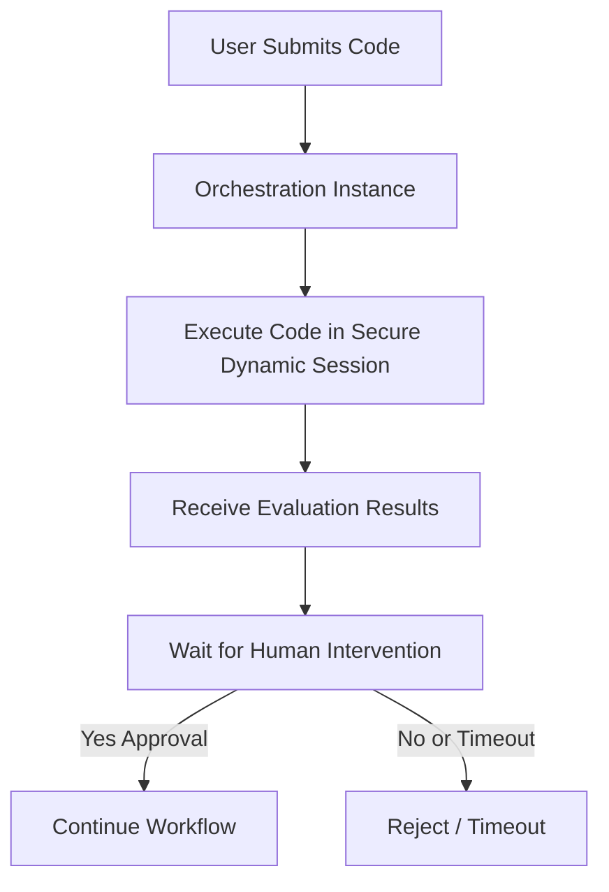

# Azure Container Apps Session Pool with Durable Task Scheduler

This project demonstrates a secure code evaluation system that combines Azure Container Apps (ACA) Session Pool for Python code execution with Azure Durable Task Scheduler for orchestrating the workflow, including a human approval step.

## Architecture

### Components

- **Azure Container Apps Session Pool**: Provides isolated Python runtime environments for executing code
- **Azure Durable Task Scheduler**: Orchestrates the workflow with persistence and reliability
- **Azure Container Apps**: Exposes endpoints (Web API) for code submission, approval and hosts the durabale workers.

### Workflow



## Prerequisites

- Azure CLI
- .NET 8 SDK
- Azure Subscription
- Bash or compatible shell

## Setup Azure Resources

The following bash commands contains all necessary Azure CLI commands to set up required resources.

```bash
# Set variables
RESOURCE_GROUP=myResourceGroup
LOCATION=westus2
CONTAINER_APP_ENV=myContainerEnv
SESSION_POOL_NAME=mySessionPool
SCHEDULER_NAME=myDurableScheduler
TASKHUB_NAME=myTaskHub
ENTRAID_USERNAME =your entra id email 

# Create resource group
az group create --name $RESOURCE_GROUP --location $LOCATION

# Create Session Pool for code evaluation sessions
az containerapp sessionpool create \
  --name $SESSION_POOL_NAME \
  --resource-group $RESOURCE_GROUP \
  --location $LOCATION \
    --container-type PythonLTS \
    --max-sessions 100 \
    --cooldown-period 300 \
    --network-status EgressDisabled

az containerapp sessionpool show \
    --name $SESSION_POOL_NAME \
    --resource-group $RESOURCE_GROUP \
    --query 'properties.poolManagementEndpoint' -o tsv

# Store the session pool URL in a variable
SESSION_POOL_URL=$(az containerapp sessionpool show \
    --name $SESSION_POOL_NAME \
    --resource-group $RESOURCE_GROUP \
    --query 'properties.poolManagementEndpoint' -o tsv)

echo "Session Pool URL: $SESSION_POOL_URL"
    
# Create Durable Task Scheduler
az durabletask scheduler create \
  --name $SCHEDULER_NAME \
  --resource-group $RESOURCE_GROUP \
  --location $LOCATION

# Create Durable Task Scheduler Task Hub
az durabletask taskhub create \
 --resource-group $RESOURCE_GROUP \
 --scheduler-name $SCHEDULER_NAME \
 --name $TASKHUB_NAME

# Get the connection string for the Durable Task Scheduler
endpoint=$(az durabletask scheduler show \
 --resource-group $RESOURCE_GROUP \
 --name $SCHEDULER_NAME \
 --query 'properties.endpoint' -o tsv)

# Note that for managed identity the connection string will be different. e.g. Authentication=ManagedIdentity;ClientId=#########
DURABLE_TASK_SCHEDULER_CONNECTION_STRING="${endpoint};Authentication=DefaultAzure;TaskHub=${TASKHUB_NAME}"

DURABLE_TASK_SCHEDULER_RESOURCE_ID=$(az durabletask scheduler show \
 --resource-group $RESOURCE_GROUP \
 --name $SCHEDULER_NAME \
 --query 'id' -o tsv)


# Assign Durable Task Data Contributor role to the user
assignee=$(az ad user show --id "$ENTRAID_USERNAME" --query "id" --output tsv)
roleId="0ad04412-c4d5-4796-b79c-f76d14c8d402" # Durable Task Data Contributor
az role assignment create \
  --assignee "${assignee}" \
  --role "$roleId" \
  --scope $DURABLE_TASK_SCHEDULER_RESOURCE_ID


echo "Durable Task Scheduler Connection String: $DURABLE_TASK_SCHEDULER_CONNECTION_STRING"

# Print instructions for setting environment variables
echo ""
echo "Set the following environment variables in your development environment:"
echo "export SESSION_POOL_URL=\"$SESSION_POOL_URL\""
echo "export DURABLE_TASK_SCHEDULER_CONNECTION_STRING=\"$DURABLE_TASK_SCHEDULER_CONNECTION_STRING\""

```

### Required Resources

1. **Azure Container Apps Session Pool**:
   - Provides Python runtime for code execution
   - Configured with network egress disabled for security

2. **Azure Durable Task Scheduler**:
   - Manages the workflow orchestration
   - Requires a Task Hub for operation

## Configuration

The application requires the following environment variables:

- `SESSION_POOL_URL`: The management endpoint URL for the Azure Container Apps Session Pool
- `DURABLE_TASK_SCHEDULER_CONNECTION_STRING`: Connection string for the Durable Task Scheduler

## API Endpoints

### Execute Code

```
POST /code/execute
Content-Type: application/json

"print('Hello, World!')"
```

Response:

```json
{
  "RequestId": "guid"
}
```

### Approve/Reject Code Execution

```
POST /code/review?approve=true&requestId=guid
```

Response:

```json
{
  "message": "Code execution approved."
}
```

## Deployment

### Using Azure Container Apps

```bash
az containerapp create \
  --name aca-dts \
  --resource-group $RESOURCE_GROUP \
  --image aca-dts:latest \
  --environment $CONTAINER_APP_ENV \
  --ingress external \
  --target-port 8080 \
  --env-vars SESSION_POOL_URL=<your-session-pool-url> DURABLE_TASK_SCHEDULER_CONNECTION_STRING=<your-connection-string>
```

## Development

To run locally:

```bash
dotnet restore
dotnet build
dotnet run
```

## License

MIT
